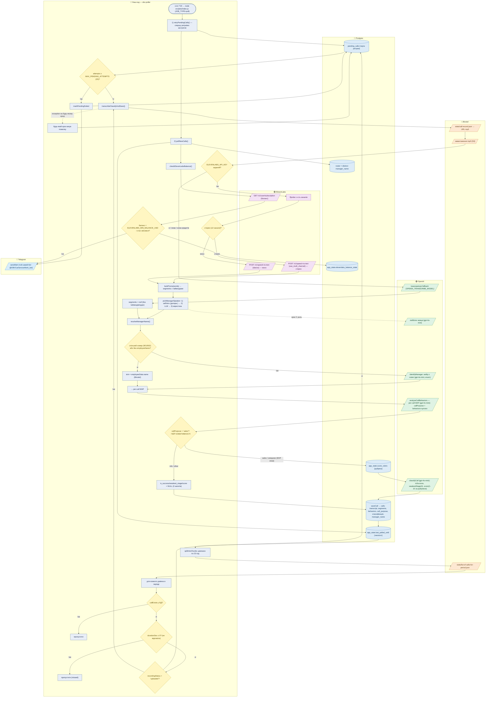
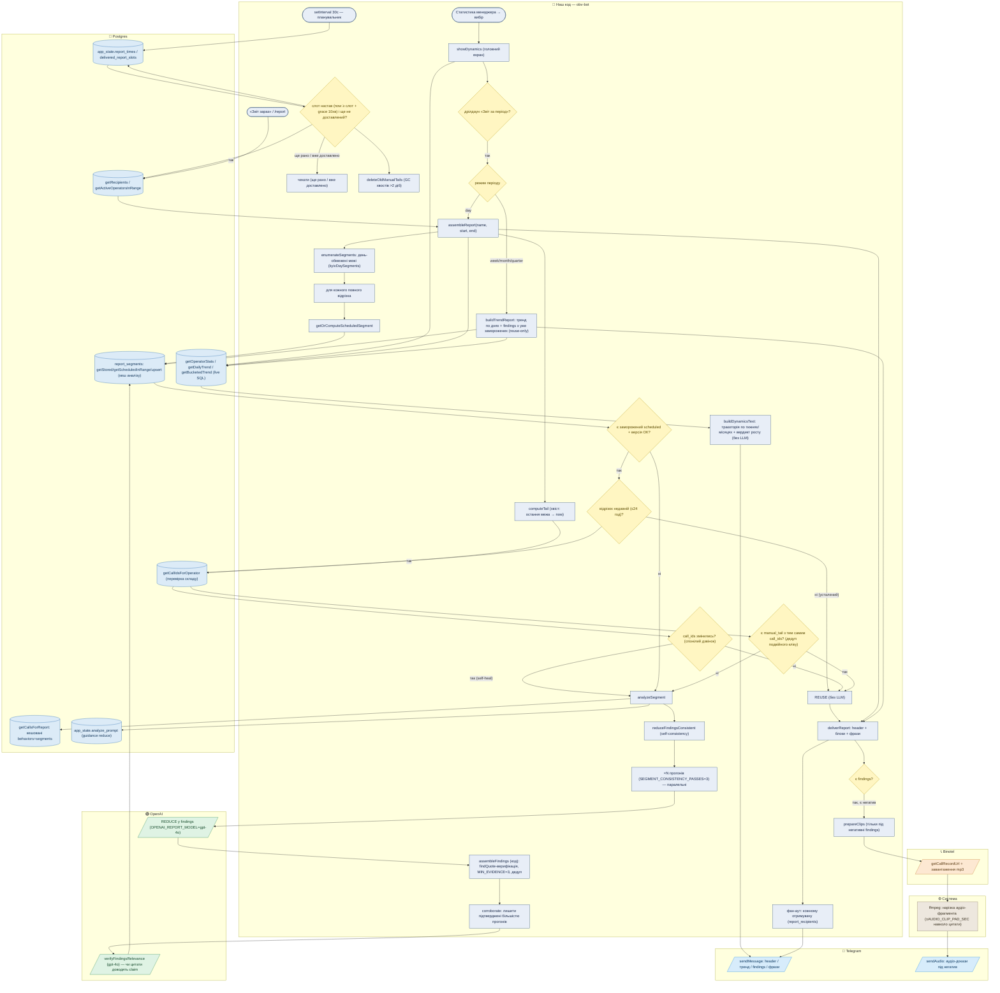
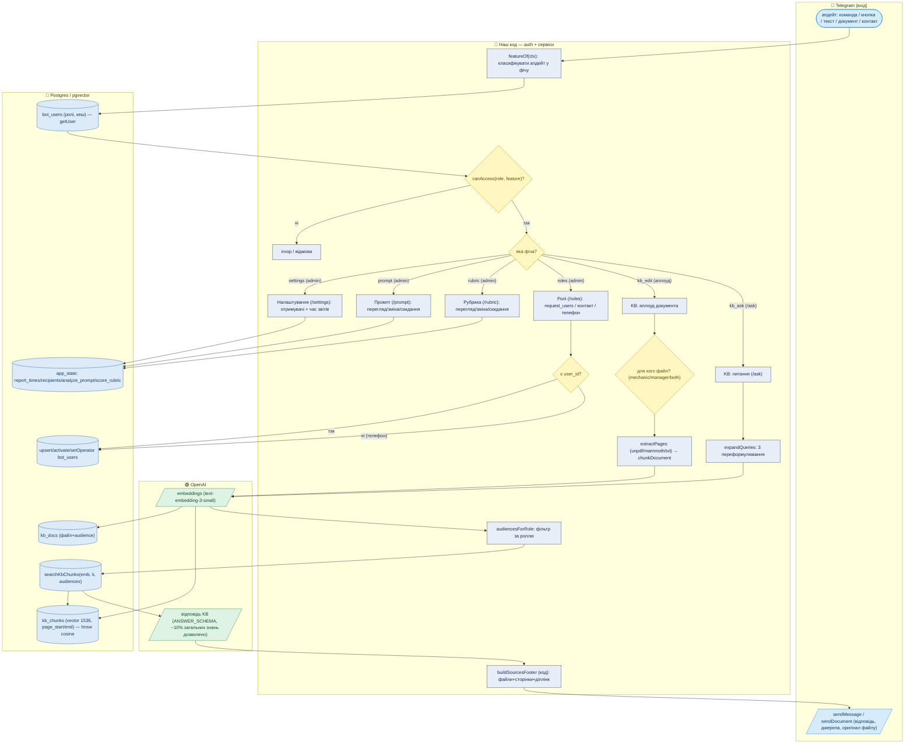

# Flowchart проєкту OBVCarService.Bot — для Miro (Mermaid)

Три зв'язані діаграми (щоб кожна лишалась читабельною), усі — **доріжки по сервісах** (subgraph = хто виконує/звідки дані) + кольорове кодування. Показано **всі зовнішні виклики**, **всі умови** (ромби) і **паралельні процеси**.

## Як залити в Miro
1. Miro board → **Create → Diagram → Mermaid** (або застосунок «Mermaid to diagram»).
2. Скопіюй **один** mermaid-блок за раз (Miro краще ковтає по одній діаграмі) — вставляй код МІЖ рядками з потрійними лапками, самі лапки не копіюй.
3. Повтори для кожної з трьох діаграм; розклади доріжки-колонки як зручно (Miro дозволяє тягати групи).

## Легенда сервісів (кольори)
- 🧩 **Наш код** (jobs/bot) — оркестрація, чиста логіка, рішення.
- 📞 **Binotel** (АТС) — джерело дзвінків і записів.
- 🟢 **OpenAI** — усі LLM/embeddings-виклики (модель підписана на вузлі).
- 🟣 **ElevenLabs** — транскрипція (STT) + баланс.
- 🔵 **Postgres/pgvector** — читання/запис даних.
- 📨 **Telegram** — вхідні апдейти й вихідні повідомлення/аудіо/алерти.
- 🔶 **Ромб** = умова (розгалуження).

> ⚠️ Два процеси працюють **паралельно й незалежно**, спілкуючись лише через Postgres: **Діаграма 1** = `obv-poller` (cron `*/15`), **Діаграми 2–3** = `obv-bot` (персистентний). Спільна БД — це «місток» між ними.

---

## Діаграма 1 — Інжест дзвінка (`obv-poller`, cron `*/15`)

Збір → транскрипція → атрибуція → per-call аналіз → **гейт мети** → збереження. Ретрай `pending_calls` іде ПЕРШИМ, потім поллінг нових.

**Ключові умови діаграми 1:** черга-ретрай (attempts≥20 → fail+alert); duration≤0 → skip; recording не готовий → в чергу; ElevenLabs є/нема → STT vs OpenAI-fallback; стерео/моно; спільний номер → AI-ідентифікація; **гейт `callPurpose`** (тільки sales → classifyCall, інакше NULL і 0 запитів); поріг балансу ElevenLabs.

---

## Діаграма 2 — Звітність + Динаміка (`obv-bot`, персистентний)

Три тригери (розклад / «Звіт зараз» / статистика менеджера). Серце — `assembleReport`: **reuse заморожених відрізків + живий хвіст**; аналіз кешується в `report_segments`.

**Ключові умови діаграми 2:** слот настав+grace+не-доставлений; заморожений відрізок є/недавній/склад-змінився (reuse vs self-heal); дедуп хвоста по `call_ids`; режим day (сегментна збірка) vs week/month (тренд, reuse-only); є findings → нарізати аудіо. **Паралельне:** планувальник vs on-demand; N прогонів reduce; per-manager цикл; фан-аут отримувачам. Числа — **завжди live**, findings — **з кешу**.

---

## Діаграма 3 — Бот-сервіси: доступ, База знань (RAG), Ролі, Налаштування, Промпт/Рубрика

**Ключові умови діаграми 3:** централізований гейт `canAccess(role, feature)` на КОЖНОМУ апдейті; audience-фільтр KB за роллю (механік не бачить менеджерських посібників); RAG — multi-query (3 переформулювання) → pgvector-пошук → структурована відповідь + детермінований блок джерел; ролі pending→active за телефоном.

---

## Що зверніть увагу при рев'ю потоку
- **Провенанс даних:** дивись, у якій доріжці вузол — це і є джерело. `communication_score` і `weakest_stage` народжуються ЛИШЕ у `classifyCall` (OpenAI, діаграма 1) і лише для `sales`. `findings` — у `reduceFindingsConsistent` (OpenAI, діаграма 2) з кешованих `behaviors`. Числа звітів — завжди live SQL (Postgres), не LLM.
- **Що кешується раз:** per-call MAP (`calls.behaviors`, інжест) і per-segment REDUCE (`report_segments`, бот). Повторні звіти їх не перераховують.
- **Єдина таксономія:** 4 етапи (`core/stages.js`) — і в `classifyCall`, і в `analyzeCall`.
